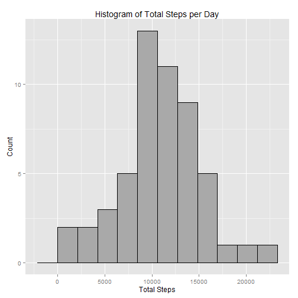
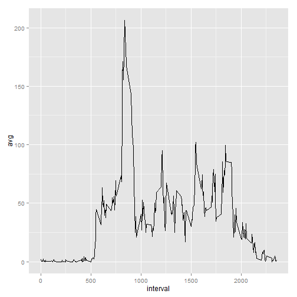
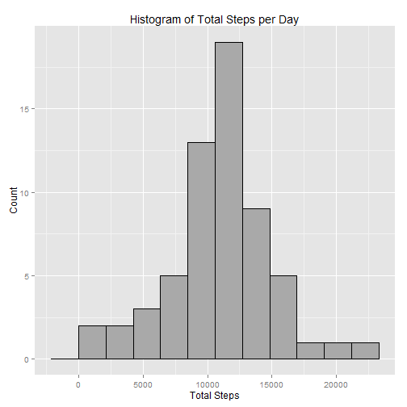
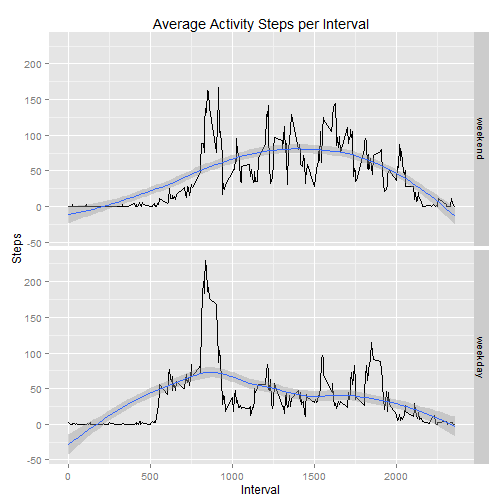

### Loading and preprocessing the data

I loaded knitr as needed and will be using dplyr and ggplot2 for my analysis and visualizations respectively.


```r
library(knitr)
library(dplyr)
library(ggplot2)
opts_chunk$set(echo = TRUE)
```

I didn't do anything fancy to read the data. I used read.csv and converted the column for date to be a date.


```r
raw_data <- read.csv("activity.csv")
raw_data$date <- as.character(raw_data$date)
raw_data$date <- as.Date(raw_data$date)
```

## What is mean total number of steps taken per day?


```r
#filters out all NA values by running complete cases on entire tbl_df.
complete_data <- raw_data %>% filter(complete.cases(.))
```

Below are the calculated total steps per day.

```r
total_steps_per_day <- summarise(group_by(complete_data,date), steps = sum(steps))
total_steps_per_day
```

```
## Source: local data frame [53 x 2]
## 
##          date steps
## 1  2012-10-02   126
## 2  2012-10-03 11352
## 3  2012-10-04 12116
## 4  2012-10-05 13294
## 5  2012-10-06 15420
## 6  2012-10-07 11015
## 7  2012-10-09 12811
## 8  2012-10-10  9900
## 9  2012-10-11 10304
## 10 2012-10-12 17382
## ..        ...   ...
```


```r
qplot(total_steps_per_day$steps,
      geom="histogram",
      binwidth = range(total_steps_per_day$steps)[2] / 10,
      main = "Histogram of Total Steps per Day",
      xlab = "Total Steps",
      ylab = "Count",
      fill = I("dark grey"),
      col = I("black")
      )
```

 

Here are the calculated mean and median total steps per day.


```r
mean_per_day <- summarise(total_steps_per_day,mean(steps))
median_per_day <-  summarise(total_steps_per_day,median(steps))

mean_per_day
```

```
## Source: local data frame [1 x 1]
## 
##   mean(steps)
## 1    10766.19
```

```r
median_per_day
```

```
## Source: local data frame [1 x 1]
## 
##   median(steps)
## 1         10765
```
The Mean is 10766 while the Median is 10765.


## What is the average daily activity pattern?

In similar fashion, I grouped data by time interval and calculated the average using the average.


```r
mean_per_interval <- summarise(group_by(complete_data,interval), 
                           avg = mean(steps))
```

Here is the resulting chart.

```r
ggplot(data=mean_per_interval, aes(x=interval, y=avg)) +
    geom_line()
```

 

In order to find the max value, I used the top_n function. The highest average value was at 8:35 am with about 206 steps. 


```r
top_n(mean_per_interval,1,avg)
```

```
## Source: local data frame [1 x 2]
## 
##   interval      avg
## 1      835 206.1698
```

## Imputing missing values

* Sum of Missing Values

The sum of missing values is equivalent to the difference in rows between raw data and complete data. The value is 2304.


```r
nrow(raw_data) - nrow(complete_data)
```

```
## [1] 2304
```

* Imputing Values Strategy

My strategy is for every NA value, to replace it with the mean steps taken for that time period. In order to do this, I combined my raw data with the mean_per_interval avg column. I used mutate to then fill out any value that was NA with the average steps.


```r
imputed_data <- cbind(raw_data, avg = mean_per_interval$avg)
imputed_data <- mutate(imputed_data,steps = ifelse(is.na(steps),avg,steps))
```


```r
imputed_total_steps_per_day <- summarise(group_by(imputed_data,date), steps = sum(steps))
imputed_mean_per_day <- summarise(imputed_total_steps_per_day,mean(steps))
imputed_median_per_day <-  summarise(imputed_total_steps_per_day,median(steps))

imputed_mean_per_day
```

```
## Source: local data frame [1 x 1]
## 
##   mean(steps)
## 1    10766.19
```

```r
imputed_median_per_day
```

```
## Source: local data frame [1 x 1]
## 
##   median(steps)
## 1      10766.19
```

If we take a look at the imputted data, the mean and median are both 10766. This means that only the median changed and slightly. The total must also have gone up as mean stayed the same, but number of days that are part of imputted data set is greater. For example, no data was imputted for 10/01.


Here is the histogram showing the imputted dataset. Notice that it is less skewed than the previous one. This intuitively makes sense as we used average per interval to replace NA.s

```r
qplot(imputed_total_steps_per_day$steps,
      geom="histogram",
      binwidth = range(imputed_total_steps_per_day$steps)[2] / 10,
      main = "Histogram of Total Steps per Day",
      xlab = "Total Steps",
      ylab = "Count",
      fill = I("dark grey"),
      col = I("black")
      )
```

 

 


## Are there differences in activity patterns between weekdays and weekends?

In order to do this analysis, I need to convert dates to day of the week, and then classify them as weekends or weekdays. I also need to calculate the average values per week day and weekend in order to plot them.


```r
imputed_data <- mutate(imputed_data,day = weekdays(date))
imputed_data <- mutate(imputed_data,day_type = ifelse(day %in% c("Saturday","Sunday"),0,1))
imputed_data$day_type <- factor(imputed_data$day_type,labels = c("weekend","weekday"))
mean_per_interval_per_day_type <- summarise(group_by(imputed_data,day_type,interval),avg = mean(steps))
```

Here is the plot comparing weekend activity to weekday activity.

```r
qplot(x = interval,
      y = avg,
      data = mean_per_interval_per_day_type,
      xlab = "Interval",
      ylab = "Steps",
      main = "Average Activity Steps per Interval",
      facets = day_type ~.,
      geom = c("line","smooth")
      )
```

```
## geom_smooth: method="auto" and size of largest group is <1000, so using loess. Use 'method = x' to change the smoothing method.
## geom_smooth: method="auto" and size of largest group is <1000, so using loess. Use 'method = x' to change the smoothing method.
```

 

There's a few things that stick out. Notice how weeekend activity tends to be more active in the afternoon, while early morning is where the most activity is for weekdays. This intuitively makes sense as mornings are when people are rusing out the door. On the weekends, the afternoon is when people socialize.
